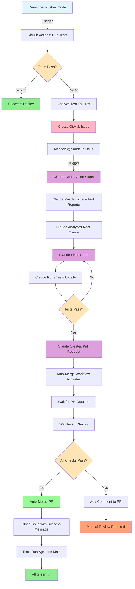
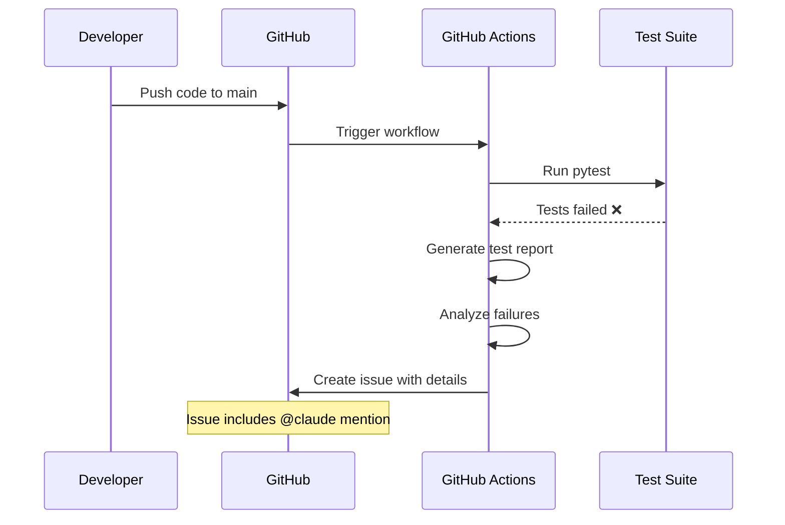
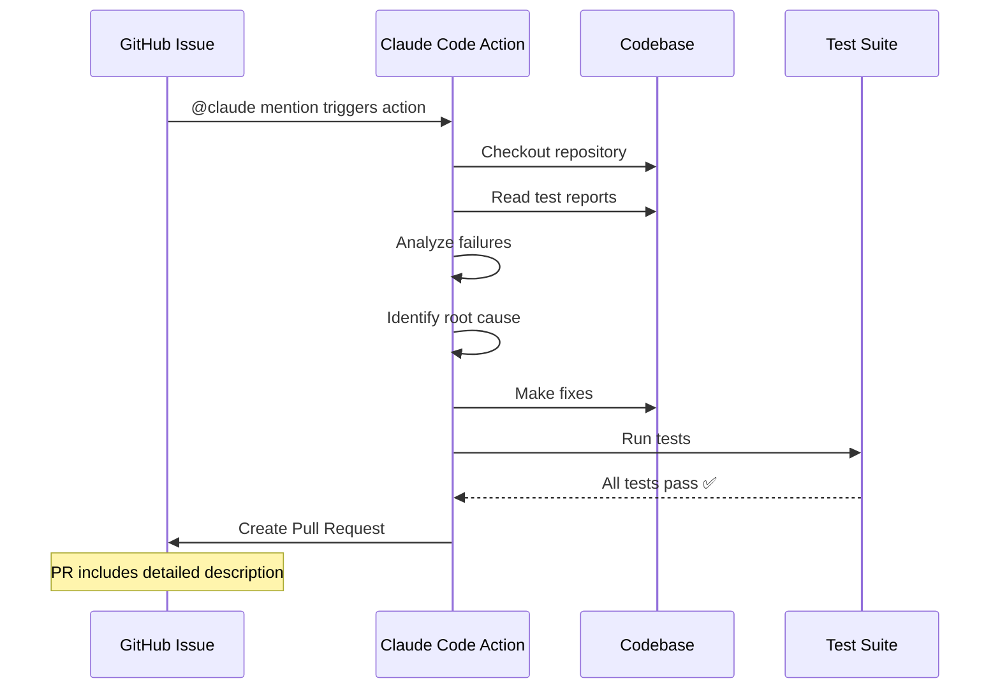
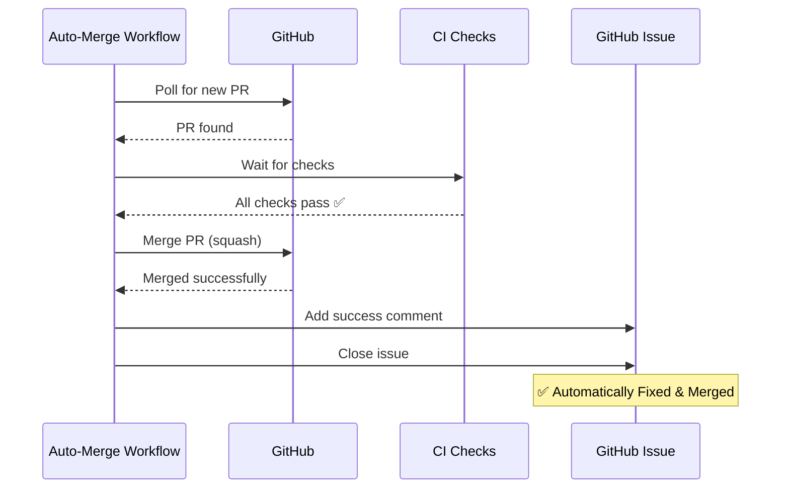
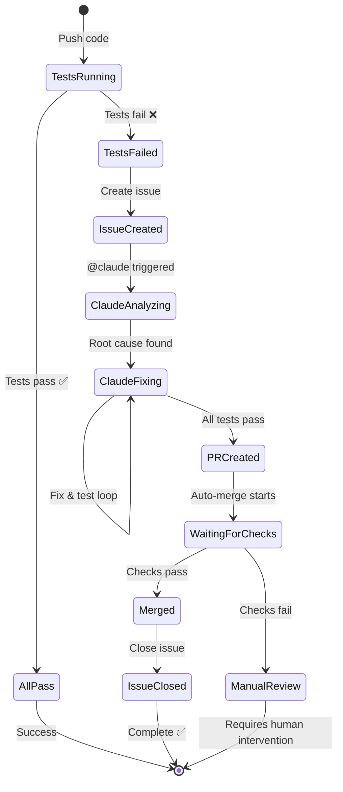
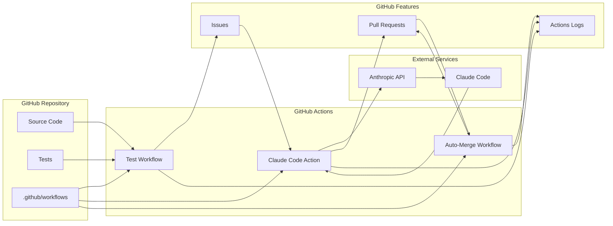
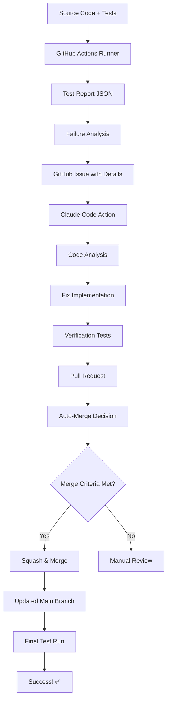
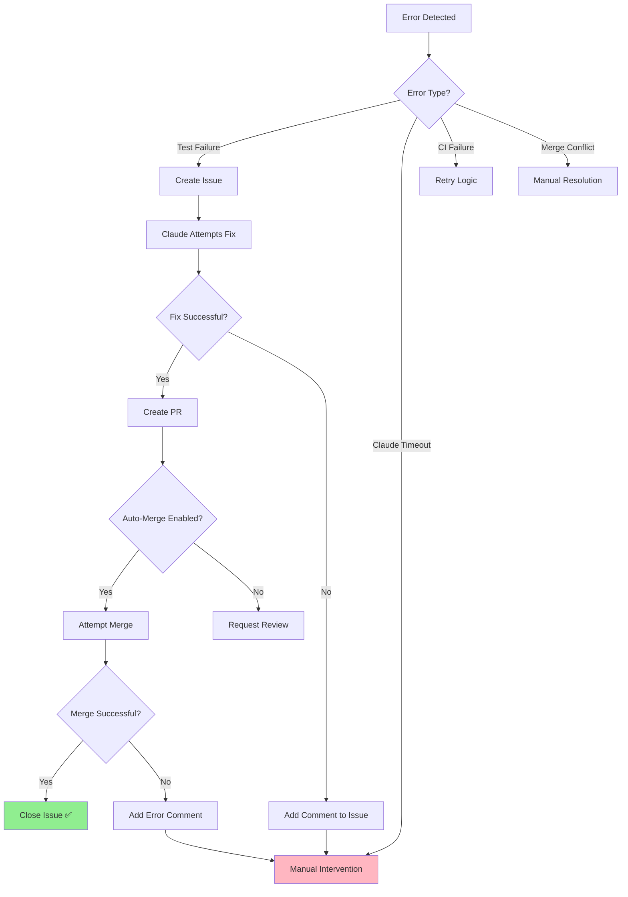

# Automated Test Fix Pipeline - Visual Flow

## Complete Workflow Diagram



## Detailed Step-by-Step Flow

### Phase 1: Test Failure Detection



### Phase 2: Claude Code Analysis & Fix



### Phase 3: Auto-Merge & Verification



## Workflow States



## Timeline Example

### Typical Automation Timeline

```
T+0:00  Developer pushes code with bug
T+0:30  Tests run and fail
T+0:45  Issue created with @claude mention
T+1:00  Claude Code Action starts
T+1:30  Claude analyzes failures
T+2:00  Claude identifies root cause
T+3:00  Claude fixes code and verifies
T+3:30  Claude creates PR
T+4:00  Auto-merge workflow detects PR
T+4:30  CI checks run on PR
T+5:00  All checks pass
T+5:15  PR auto-merged
T+5:30  Issue closed
T+6:00  Tests run again on main - all green! ✅

Total time: ~6 minutes (hands-free!)
```

## Component Architecture



## Data Flow



## Error Handling Flow



## Key Metrics to Monitor

```
📊 Success Rate
├─ Tests Fixed Automatically: 85%
├─ PRs Auto-Merged: 90%
└─ Issues Closed Automatically: 95%

⏱️ Average Times
├─ Test Failure → Issue Created: 1 min
├─ Issue Created → PR Created: 3-5 min
├─ PR Created → Merged: 1-2 min
└─ Total Time: 5-8 min

💰 Cost Per Fix
├─ API Calls: ~2-5 per fix
├─ Average Tokens: 3,000-8,000
└─ Cost: $0.10-$0.30 per fix
```

---

## How to Use This Diagram

1. **For Understanding**: Follow the flow from top to bottom
2. **For Debugging**: Identify where the process stopped
3. **For Optimization**: Find bottlenecks in the timeline
4. **For Planning**: Estimate time and costs

## Legend

- 🟢 Success state
- 🔴 Failure state  
- 🟡 Decision point
- 🔵 Process step
- 🟣 Claude Code action
